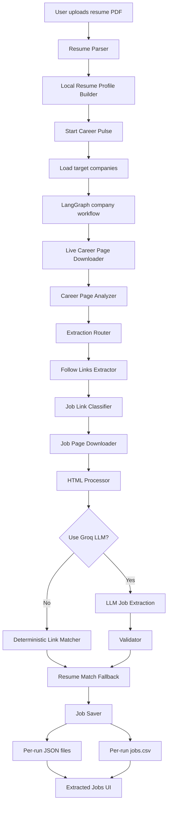

# Career Pulse

Career Pulse is an AI-powered career intelligence platform that helps a candidate discover relevant opportunities directly from company career pages.

Instead of searching job boards, Career Pulse works like an agentic job-search assistant:

1. The user uploads a resume.
2. The app parses the resume into skills, roles, and keywords.
3. The pipeline visits company career pages live.
4. It analyzes each career page and extracts job/search links.
5. It matches opportunities against the uploaded resume.
6. It saves each run as JSON and CSV so the user can review or export results.

The long-term direction of the project is a fully agentic workflow using **LangGraph**, **LangChain**, **Playwright**, **BeautifulSoup**, **Groq**, and **Streamlit**.

---

## Features

- Resume upload and PDF parsing
- Resume-aware role and keyword generation
- Live company career-page crawling at button click time
- LangGraph-based pipeline orchestration
- ATS and career-page strategy detection
- Job/link classification and filtering
- Cloudflare/security-verification detection and skipping
- Optional Groq LLM extraction
- Deterministic fallback that creates live resume-based company search links
- Per-run output folders
- JSON and CSV exports
- Streamlit dashboard with pages for:
  - Dashboard
  - Resume
  - Profile
  - Companies
  - Discover Jobs
  - Extracted Jobs
  - Analytics
  - Settings
  - Logs
  - About

---

## Tech Stack

| Layer | Technology |
|---|---|
| App UI | Streamlit |
| Agent Orchestration | LangGraph |
| LLM Framework | LangChain |
| LLM Provider | Groq |
| Browser Automation | Playwright |
| HTML Parsing | BeautifulSoup |
| Resume PDF Parsing | PyMuPDF |
| Data Handling | Pandas |
| Charts | Plotly |
| Storage | JSON and CSV |

---

## High-Level Workflow



---

## LangGraph Node Workflow

Each company is processed through a shared graph state.

```mermaid
flowchart LR
    START((START)) --> A[Live Career Page Downloader Node]
    A --> B[Career Page Analyzer Node]
    B --> C[Extraction Router Node]
    C --> D[Job Link Classifier Node]
    D --> E[Job Page Downloader Node]
    E --> F[HTML Processor Node]
    F --> G[Resume Match Fallback Node]
    G --> H[Job Saver Node]
    H --> I[Stats Node]
    I --> END((END))
```



The graph state includes:

- company
- career URL
- downloaded HTML
- page analysis
- discovered job links
- downloaded job pages
- extracted jobs
- skipped URLs
- logs
- errors
- statistics
- resume profile
- run configuration

---

## Project Structure

```text
Career_pulse/
├── app.py
├── main.py
├── requirements.txt
├── agents/
│   ├── career_page_analyzer/
│   ├── career_page_downloader/
│   ├── company_discovery/
│   ├── extraction_router/
│   ├── follow_links_extractor/
│   ├── html_processor/
│   ├── job_link_classifier/
│   ├── job_matcher/
│   ├── job_page_downloader/
│   ├── job_page_processor/
│   ├── job_saver/
│   ├── pipeline/
│   ├── profile_builder/
│   ├── query_builder/
│   └── resume_parser/
└── outputs/
    ├── company_career.json
    ├── runs/
    │   └── <timestamp>/
    │       ├── jobs/
    │       │   ├── Company.json
    │       │   └── ...
    │       └── jobs.csv
    └── ...
```

---

## How Outputs Are Saved

Career Pulse saves every new discovery run separately.

Example:

```text
outputs/runs/20260716_140125/jobs/
outputs/runs/20260716_140125/jobs/Apple.json
outputs/runs/20260716_140125/jobs/NVIDIA.json
outputs/runs/20260716_140125/jobs.csv
```

The CSV contains columns like:

```text
company, role, location, employment_type, experience, apply_link, match_score, source, description
```

The **Extracted Jobs** page reads the active/latest run, not stale preloaded files.

---

## Installation

### 1. Clone the repository

```bash
git clone https://github.com/your-username/Career_pulse.git
cd Career_pulse
```

### 2. Create a virtual environment

macOS/Linux:

```bash
python3 -m venv .venv
source .venv/bin/activate
```

Windows:

```bash
python -m venv .venv
.venv\Scripts\activate
```

### 3. Install dependencies

```bash
pip install -r requirements.txt
```

### 4. Install Playwright browsers

```bash
playwright install
```

### 5. Add environment variables

Create a `.env` file:

```env
GROQ_API_KEY=your_groq_api_key_here
```

Groq is optional for basic live resume-search links, but required for LLM-based job extraction.

---

## Running the App

```bash
streamlit run app.py
```

Or:

```bash
python -m streamlit run app.py
```

Then open:

```text
http://localhost:8501
```

---

## How to Use

1. Open the Streamlit app.
2. Go to **Discover Jobs**.
3. Upload your resume PDF.
4. Choose how many companies to scan.
5. Keep **Run browser in background** enabled.
6. Keep **Use Groq LLM extraction** off if you do not have Groq credits or are rate-limited.
7. Click **Start Career Pulse**.
8. Go to **Extracted Jobs**.
9. Click **Refresh saved jobs**.
10. Download the run CSV using **Download Saved Run CSV**.

---

## Important Runtime Modes

### Fast mode: match live career links only

This avoids downloading deeper job pages and creates resume-matched live career/search links from company pages.

Use this when:

- you want faster runs
- company websites block automation
- Groq is unavailable
- you want current company search links based on the resume

### Use Groq LLM extraction

This attempts to extract structured job data from downloaded job pages.

Use this when:

- `GROQ_API_KEY` is configured
- you have enough Groq rate limit available
- the company does not block job-page crawling

---

## Current Limitations

Some company career sites use bot protection such as Cloudflare or custom security checks. Career Pulse does **not** bypass these protections. It detects those pages, skips them, logs the reason, and continues.

Common cases:

- Cloudflare human verification
- ATS pages requiring JavaScript or sessions
- Groq rate limits
- Career sites that render jobs only after complex client-side API calls

When exact job postings are not visible, Career Pulse can still save live resume-based company search links, marked with:

```text
source = live_resume_search
```

This makes it clear that the row is a current search entry point, not a fully extracted job description.

---

## Troubleshooting

### `NameError: name 'Any' is not defined`

This was caused by LangGraph evaluating state type hints. The graph state now uses JSON-like typed fields instead of `Any`.

### `RuntimeError: Directory 'static/' does not exist`

This can happen if the wrong `fitz` package is installed. This project uses **PyMuPDF**, not the unrelated `fitz` package.

Use:

```bash
pip uninstall fitz frontend -y
pip install pymupdf
```

### Playwright browser does not open or download pages

Run:

```bash
playwright install
```

### Groq rate limit error

Turn off **Use Groq LLM extraction** in the app, or wait until your Groq quota resets.

### No jobs are saved

Possible reasons:

- the career site blocked automation
- the company did not expose relevant jobs publicly
- the selected company pages were broad marketing pages
- Groq extraction was disabled or rate-limited

Try:

- increasing the number of companies
- turning on fast mode
- running without Groq first
- checking the **Logs** page

---

## Roadmap

- ATS-specific extractors
  - Greenhouse
  - Lever
  - Workday
  - Ashby
  - SmartRecruiters
- Better live job-card extraction
- Resume-to-job ranking
- Application tracking
- PostgreSQL storage
- Vector search
- FastAPI backend
- LangSmith tracing
- Scheduled daily discovery
- Authentication and cloud deployment

---

## Why This Project Matters

Most job platforms show the same reposted jobs repeatedly. Career Pulse is built around a different idea:

> Go directly to company career pages, understand the candidate, discover opportunities live, and save only what is relevant.

It is not just a scraping script. It is a step toward an agentic career assistant that can reason over a resume, navigate company career sites, extract opportunities, and help candidates act faster.

---

## License

Add your preferred license before publishing publicly.

